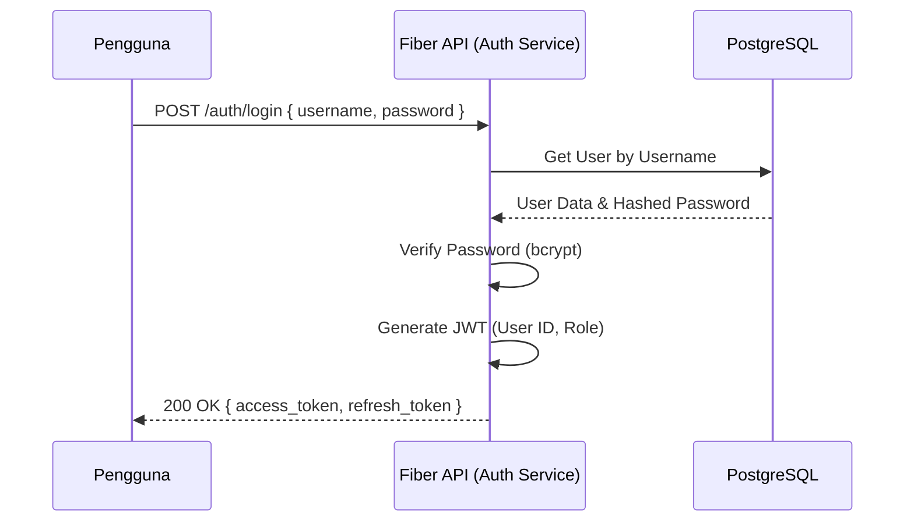

# 🔐 Authentication & Authorization Flow

Sistem ini menggunakan **JWT (JSON Web Token)** untuk otentikasi.

## 1. Login Flow

Proses autentikasi awal untuk mendapatkan token akses.



## 2. JWT Payload Structure

Payload token mengandung informasi identitas user dan role.

```json
{
  "sub": "uuid-user-123",
  "role": "DOKTER",
  "exp": 1713256789,
  "iat": 1713213589
}
```

## 3. Middleware

Setiap request yang membutuhkan otentikasi harus melalui `AuthMiddleware`.

### Mekanisme:
1. **Validation**: Middleware memvalidasi signature JWT dan expiration.
2. **Context Injection**:
   - Data user (ID & Role) diambil dari claims JWT.
   - Disimpan ke dalam local context Fiber (`c.Locals("user_id", userID)`).

## 4. Authorization (RBAC)

Pengecekan hak akses dilakukan di tingkat *Delivery/Handler* atau *Usecase* menggunakan roles yang ada di JWT.

- **Role Example**: `ADMIN`, `DOKTER`, `PERAWAT`, `FARMASI`, `KASIR`.
