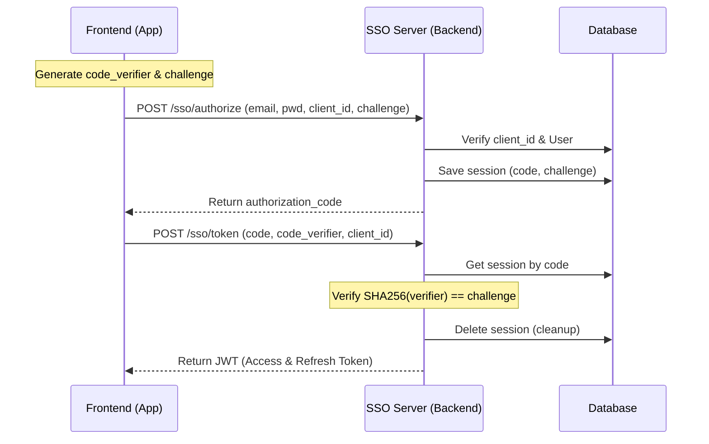

# SSO Architecture: PKCE with Whitelist Strategy

## Overview
Arsitektur SSO ini dirancang untuk mendukung ekosistem modular SIMRS yang menggunakan domain berbeda antara Identity Provider (SSO) dan Application Modules (Master Data, Poli, Finance, dll).

**Domain Setup:**
- **SSO Domain:** `sso-neurovi-simulation.test`
- **Application Domain:** `neurovi-simulation.test` (and subdomains)

## Mekanisme: PKCE (Proof Key for Code Exchange)
Karena aplikasi frontend (Vue/SPA) adalah *public client* yang tidak bisa menyimpan *client_secret* secara aman, kita menggunakan flow PKCE.

### Komponen Utama:
1.  **Code Challenge:** String yang di-hash (S256) oleh FE saat inisiasi login.
2.  **Code Verifier:** String asli yang dikirim FE saat penukaran token untuk verifikasi.
3.  **Authorization Code:** Tiket sementara (short-lived) yang dikeluarkan SSO setelah user login.

## Strategi Whitelist (Table: `oauth_clients`)
Untuk keamanan lintas domain, SSO menggunakan metode whitelist untuk memastikan data hanya dikirim ke aplikasi terpercaya.

### Parameter Whitelist:
| Field | Deskripsi |
|-------|-----------|
| `client_id` | Identifier unik aplikasi (e.g., `simrs-finance-app`). |
| `redirect_uris` | Daftar URL callback yang diizinkan. SSO akan menolak redirect ke URL di luar daftar ini. |
| `name` | Nama aplikasi untuk tampilan user (jika perlu consent). |

### Keamanan:
- **Mencegah Open Redirect:** Menjamin `code` tidak terkirim ke domain attacker.
- **Client Identification:** SSO tahu persis aplikasi mana yang sedang meminta akses.

## Flow Handshake


## Database Schema Reference
```sql
CREATE TABLE oauth_clients (
    id UUID PRIMARY KEY,
    client_id VARCHAR(100) UNIQUE NOT NULL,
    client_secret VARCHAR(255), -- Optional for PKCE
    name VARCHAR(100),
    redirect_uris TEXT, -- Comma separated
    created_at TIMESTAMP WITH TIME ZONE DEFAULT CURRENT_TIMESTAMP
);

CREATE TABLE auth_code_sessions (
    code VARCHAR(255) PRIMARY KEY,
    client_id VARCHAR(100),
    user_id UUID,
    code_challenge TEXT,
    redirect_uri TEXT,
    expires_at TIMESTAMP WITH TIME ZONE
);
```

## Storage Optimization (Redis)
Untuk skalabilitas tinggi dan efisiensi penyimpanan, penyimpanan `auth_code_sessions` disarankan menggunakan **Redis** daripada database relasional (PostgreSQL).

### Keunggulan Redis:
- **Auto-Cleanup (TTL):** Menggunakan fitur `EXPIRE` untuk menghapus session secara otomatis setelah 5 menit.
- **Performance:** Kecepatan baca/tulis di memory jauh lebih tinggi untuk data yang bersifat sementara.
- **Database Hygiene:** Mencegah "data sampah" (expired codes) menumpuk di database utama.

**Rencana Implementasi:**
1.  Gunakan Redis sebagai key-value store dengan key: `sso:code:{code}`.
2.  Value berupa JSON yang berisi `client_id`, `user_id`, `code_challenge`, dll.
3.  Set TTL saat menyimpan (misal: 300 detik).
